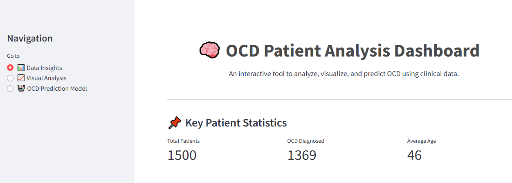
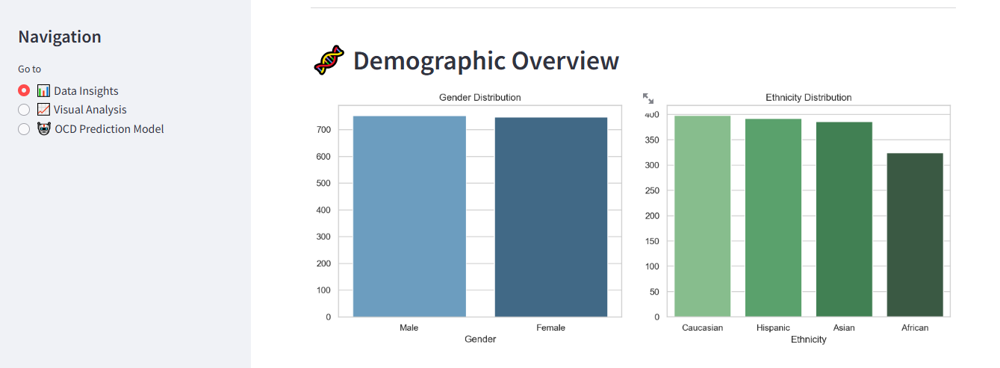
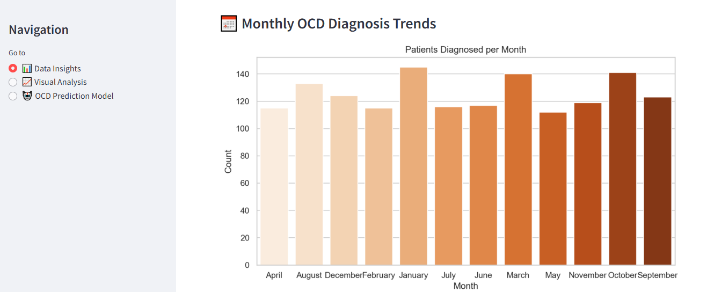
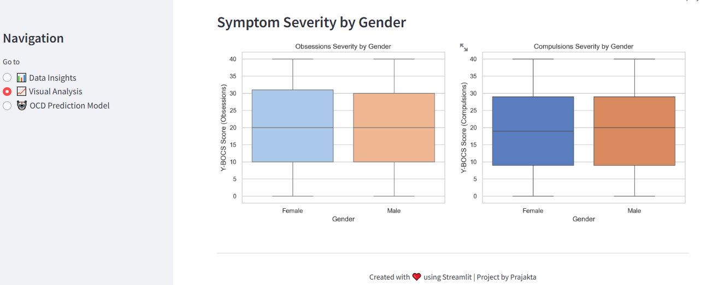
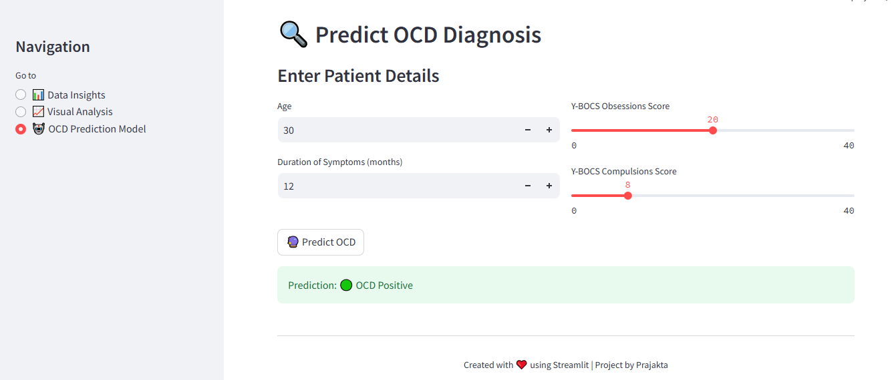

# 🧠 OCD Patient Analysis Dashboard
An interactive Streamlit dashboard to explore, visualize, and predict Obsessive-Compulsive Disorder (OCD) diagnoses using clinical and demographic data.

## 🚀 Live Demo
[Click here to try the dashboard](https://ocdanalysis-app.streamlit.app/)

## 📌 Features
- 📊 **Data Insights**: Explore patient demographics, monthly trends, and diagnosis stats.
- 📈 **Visual Analysis**: Compare symptom severity across genders and treatment methods.
- 🤖 **ML Prediction Model**: Input patient details to predict OCD likelihood using a trained Random Forest Classifier.
- 🧠 **Mental Health Application**: Use real Y-BOCS scores for clinical-level prediction.
- 💡 **Responsive Design**: Streamlit app styled with Seaborn, custom themes, and emojis to enhance user experience.

## 🧪 Tech Stack
| Tool | Purpose |
|------|---------|
| **Python** | Core language |
| **Pandas / NumPy** | Data cleaning & manipulation |
| **Matplotlib / Seaborn** | Data visualization |
| **Scikit-learn** | Machine learning model |
| **Streamlit** | Web dashboard development |

## 📸 Dashboard Screenshots
### 1.Header

### 2. Demographics Analysis 

### 3. Patients per Month  

### 4. Symptom Severity  

### 5. OCD Prediction  

## 🙋‍♀️ Author
#### 👩‍💻 Prajakta Magdum.
#### 📧 gourimagdum2000@gmail.com

